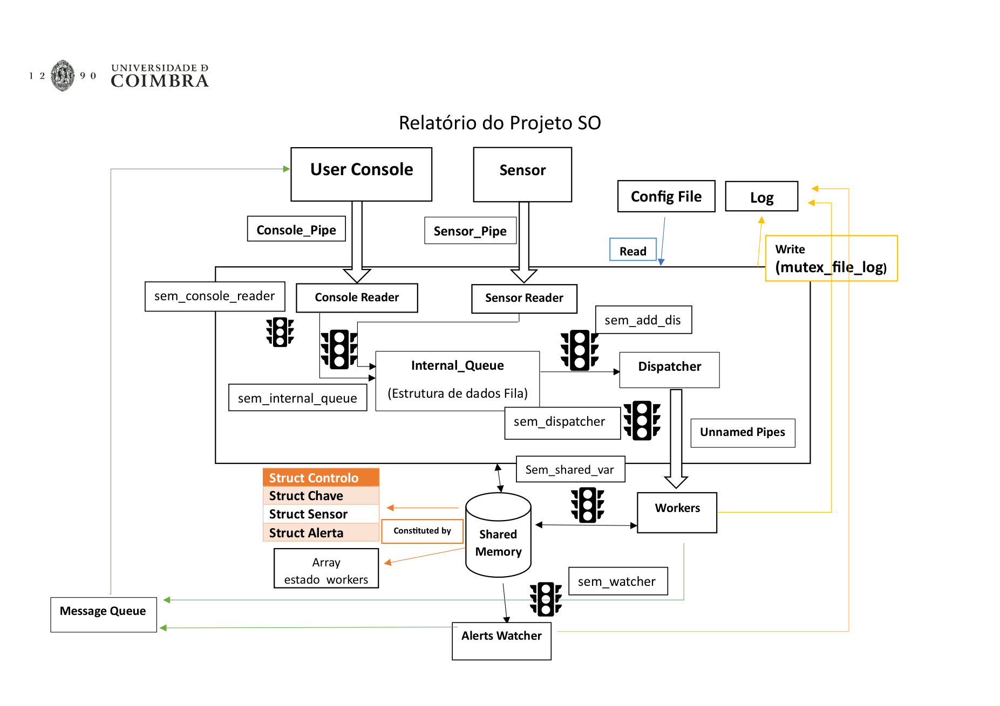

# Home IoT Simulator: Concurrent Systems Programming in C

A multi-process, multi-threaded IoT data aggregation system built in C on POSIX
IPC primitives: shared memory, message queues, named and unnamed pipes, named
semaphores and signal handling.



## Overview

The system simulates a home IoT hub. Independent sensor processes push readings
in, user console processes issue queries and configure alerts, and a central
manager aggregates everything, maintaining per-key statistics and firing alerts
when values leave their configured range.

The point of the project is the concurrency and IPC design, not the IoT domain.
Three separate executables communicate across process boundaries, and inside the
manager a thread pool consumes a shared work queue. Every shared structure is
protected, and the whole system shuts down cleanly on `SIGINT` after draining
in-flight work.

## Architecture

`home_iot` (the system manager) forks and spawns:

| Component | Kind | Role |
|---|---|---|
| Sensor Reader | thread | reads `/tmp/SENSOR_PIPE`, enqueues onto the internal queue |
| Console Reader | thread | reads `/tmp/CONSOLE_PIPE`, enqueues onto the internal queue |
| Dispatcher | thread | pops the internal queue, hands work to a free worker |
| Workers | processes | consume commands, update shared memory, reply to consoles |
| Alerts Watcher | process | watches shared memory, notifies consoles on threshold breach |

Data flows through, in order: named pipes → bounded internal queue → unnamed
pipes (one per worker) → shared memory → message queue back to the consoles.

**IPC and synchronisation used:**

- **Shared memory** (`shmget`/`shmat`) holds the `Controlo` structure: the sensor
  registry, per-key statistics, the alert table, and the worker-state array.
- **System V message queue** (`msgget`/`msgsnd`/`msgrcv`) carries replies from
  workers and the alerts watcher back to the right console, addressed by the
  console id in the message type field.
- **Named pipes** (`mkfifo`) are the entry points for sensors and consoles, so
  any number of independent processes can attach.
- **Unnamed pipes** (`pipe`), one per worker, carry dispatched commands.
- **Named semaphores** (`sem_open`): `SEM_SHARED_VAR` guards shared memory,
  `SEM_INTERNAL_QUEUE` the queue, `SEM_DISPATCHER` counts free workers,
  `SEM_CONSOLE_READER`, `SEM_ADD_DIS` and `SEM_WATCHER` sequence the rest.
- **Process-shared mutex** (`pthread_mutexattr_setpshared`) serialises log writes
  across processes, not just threads.
- **Signals** (`sigaction`, `SIGINT`/`SIGTSTP`): `SIGINT` triggers an ordered
  shutdown that lets in-flight tasks finish before releasing every IPC resource.

`SEM_DISPATCHER` is initialised to the worker count, which makes it a counting
semaphore that both blocks the dispatcher when every worker is busy and doubles
as the free-worker count. That is what keeps the pipeline bounded end to end:
the internal queue has a configured maximum, and the dispatcher cannot outrun the
pool.

## Configuration

`config.example.txt` holds five integers, one per line, in this order:

```
1      queue_sz      max entries in the internal queue  (>= 1)
2      n_workers     worker processes                   (>= 1)
2      max_keys      distinct sensor keys tracked       (>= 1)
10     max_sensors   sensors that may register          (>= 1)
1      max_alerts    alerts that may be registered      (>= 0)
```

The parser is a strict `fscanf` over five integers, so the file cannot contain
comments or labels. It validates the ranges and refuses to start on bad input.

## Running the Project

Requires Linux (or any POSIX system with System V IPC). It will not build on
Windows with MinGW, which has no `sys/shm.h`, `sys/msg.h` or `sys/wait.h`.

```bash
make
```

Start the manager, then attach sensors and consoles from other terminals:

```bash
./home_iot config.example.txt
```

```bash
# ./sensor <id> <interval_seconds> <key> <min> <max>
./sensor SENSOR01 5 temperature 15 30
```

```bash
# ./console <console_id>
./console 1
```

Console commands:

| Command | Effect |
|---|---|
| `stats` | per-key last value, min, max, average, update count |
| `sensors` | list registered sensor ids |
| `reset` | clear collected statistics |
| `add_alert <id> <key> <min> <max>` | fire when `key` leaves `[min, max]` |
| `remove_alert <id>` | drop an alert |
| `list_alerts` | list registered alerts |
| `exit` | detach the console |

Sensor ids are alphanumeric, 3 to 32 characters. `Ctrl+C` on the manager starts
the ordered shutdown; `Ctrl+Z` is trapped and ignored so the system cannot be
suspended holding IPC resources.

The manager appends to `log.txt` in the working directory.
[`docs/sample_run.log`](docs/sample_run.log) is the log from a real run, showing
thread and worker startup through to shutdown on `SIGINT`.

## Repository Structure

```
system_manager.c    the manager: queue, dispatcher, workers, watcher,
                    shared memory, signal handling  (~1,270 lines)
user_console.c      console client: command parsing, message queue replies
sensor.c            sensor client: periodic readings into the named pipe
structs.h           shared structures and common includes
Makefile            builds home_iot, console, sensor
config.example.txt      example configuration
docs/               architecture diagram and a sample run log
```

## Tech Stack

C · POSIX threads · System V shared memory and message queues · POSIX named
semaphores · FIFOs · signals · GNU Make

## Limitations

- Identifiers, comments and console messages are in Portuguese, since the project
  was written and graded in Portuguese. The structure and control flow are
  readable without it, but it is not an English codebase.
- Configuration is positional integers with no labels or comments, which is
  fragile to edit by hand.
- The System V message queue key is a hardcoded constant (`123`), so two
  instances on the same machine would collide.
- FIFO paths are fixed at `/tmp/SENSOR_PIPE` and `/tmp/CONSOLE_PIPE`, with the
  same consequence.
- There is no automated test suite; the system was validated by running it and
  inspecting the log, which is what the assignment asked for.

## Context

Developed with Alexandre Ferreira for the Operating Systems course, BSc in
Informatics Engineering, University of Coimbra. It predates the MSc work in my
other repositories and is kept here as the systems-programming counterpart to
them.

## License

Released under the MIT License — see [`LICENSE`](LICENSE). Copyright is shared
with Alexandre Ferreira, who co-authored the project.
